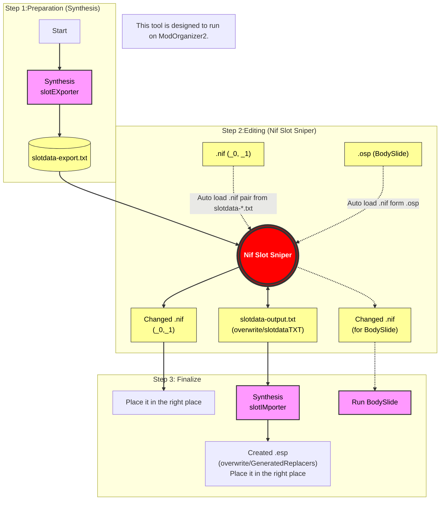

This tool makes it easy to change and bulk sync armor slots between nif and esp.
You can also change the slot of the original nif for Bodyslide.

NIF SLOT SNIPER 1.0.0

このNIF SLOT SNIPERというツールは、skyrim SE/AE用に、.esp,.nifのスロットを変更するためのものです。
slotdata-export.txtとslotdata-output.txtのデータを使います。
Mod Organizer2での使用を前提としています。

How to use

=====Synthesis nifslotEXporter

同梱しているSynthesisパッチ。実行すると、espからデータを取り出し、slotdata-export.txtが入手できる(.esp側元スロットデータ)
Mo2環境なら overwrite\slotdataTXT に出力される。

=====Nif Slot Sniper

1.slotdata-export.txt→slotdata-output.txtの順番で自動的に読み込む。

2.Nif databaseウィンドウに一覧が表示される。
2-tips:Control Panelからnif読み込みの優先gender,及び読み込みモードが選択できる。
2-tips:Singleモード:_0,_1のないnifを読み込む。Pairモード:_0,_1のあるnifを読み込む。bothモード:SingleとPairの両方（既定）
2-tips:BS OSP NIFモード:Bodyslide用のxml形式の.ospを読み込む。bodyslide処理前の元データ用。自動読み込みしないので、[Scan OSP Files]すると読み込む。

3.Nif databaseからnifを選択すると3Dで表示される。Control Panelにnif名や内部のmeshesが表示される。
3-Tips:DB slotsには、slotdata-*.txtに記載されているスロットが表示される。
3-tips: [Load Ref Body]ボタンで素体を表示し、装備の重なりを確認できる。[Show Ref]をオンにして表示。(既定では非表示)
3-tips: メニューバーの [Analysis Details] ウィンドウを開くと、なぜそのスロットが提案されたのか（どのルールで何点加算されたか）の詳細な内訳を確認できる。

4.meshes listからmeshを選択。
4-A.slotdata-*.txtのスロット情報がDB slotに表示される。
4-B.slotdata-*.txtとは異なるスロットをマニュアル入力もしくはAnalyze機能（後述）で適用(仮設定)できる。

5.Apply Changeボタンを押すと、スロット変更分がItem Pending Saveウィンドウに蓄積されていく。(本設定)
5-Tips:nifのpartitionの数以下のスロットの個数しか入力できない仕様。エラーが出て、Applyできなくなります。

6.Item Pending Saveウィンドウの[Save TXT & Export NIFs]ボタンで出力できる。

7.ツールのメイン機能が終了。

++++他の出力ボタンについて++++
@Nif Databaseウィンドウ、Slotdata-Listタブの[Export Selected Nif]ボタン
ダウンロードしたslotdata-*.txtを適用する場合に使用。
チェックボックスにチェックを入れたものが出力される。念の為、slotdata-output.txtが出力/上書きされる。
tips:チェックボックスで複数のnifを出力できる。Female nifとmale nifがあるが、ARMAで設定されたnifが片方の性別しか無い場合は、チェックした際に自動的に両性にチェックされる。

@Nif Databaseウィンドウ、Bodyslide OSP Browserタブの[Export Checked Source]ボタン//廃止予定
ダウンロードした編集済.ospを使って、bodyslideの元nifのスロット変更を連続処理するために使用。
[Save TXT & Export NIFs]ボタンでも可能のため、極力使わないでください。

tips:右クリックで、.esp単位でブロックリストに入れることができる。
ブロックリストに入れたespで使用されるnifは、たとえチェックが入っていても出力されない。（例：男性用nifがskyrimバニラに指定されている場合など）

@Control Panelウィンドウ内[Write slotdata-output.txt]ボタン
Mesh listでスロットを変更した時に出現。
nifを出力せず、slotdata-output.txtのみを出力/上書きします。

tips:slotdata-output.txtのみ出力した場合は.nifは変更されない為、Nif databaseウィンドウの[ReloadTXT]ボタンを押し、slotdata-output.txtを再読み込みすることで4.から始めることが可能。

slotdata-output.txtは、gamedataに設定しているフォルダ以下のslotdataTXTフォルダに出力される。
（フォルダを変更している場合は、slotIMporterのtxt読み込み先をSynthesis内User settingsから修正してください。）
nifslotIMporterに続く。

=====Synthesis nifslotIMporter

同梱しているSynthesisパッチ。実行すると、espにスロットデータを上書きし、.nif-.esp間でのスロット同期が完了する。
。
User settingsで選択したフォルダに出力される。
gamedata pathを選択した場合は、既定でoverwrite/GeneratedReplacersフォルダに出力されるので、手動でファイル移動してください。
Absolute pathを選択した場合は、Mo2フォルダ/mods以下に専用のフォルダを作り、そのフォルダを指定すると楽です。

Q. Synthesis (SlotImporter) で Lower FormKey range was violated というエラーが出て出力されないModがある

A. そのModはESLファイル（またはESPFE）として不正なFormIDを含んでいます。 Nif Slot Sniperの問題ではなく、対象Modのデータ構造の問題です。

対処法: SSEEdit (xEdit) でそのModを開き、対象Modを右クリックして "Compact FormIDs for ESL" を実行し、保存してください。これにより正しいFormIDが割り振られ、エラーが解消されます。

////////////////////////////////////////////////////////////
このツールで出力されるもの
exeと同じフォルダ
・imgui.ini - ウィンドウの設定が保存されています。
・config.ini - 入出力するパス、個人的につけたスロットの名前、ブロックリストが保存されています。

出力先フォルダ
・slotdata-*.txtからのnifファイル - 設定したパスの下にmeshesフォルダを作り、以下に出力します。
・osp由来の.nifファイル - 設定したフォルダの下にCalienteTools/Bodyslide/ShapeDataフォルダ階層を作り、その下に出力します。
・*_KID.ini - 設定したフォルダに出力されます。espごとに出力されます。既に存在する場合は追記します。

overwrite/slotdataTXTフォルダ
・slotdata-output.txt - このツールで編集したデータが出力されます。[ReloadTXT]でツール内にリロードできます。

//////////////////////////
★スロット解析機能 (Analyze Slots) について
Nif Slot Sniperのメイン機能はnifのスロット変更であるが、slotdata-*.txtにより一括変更が可能になっている。
しかしsynthesisで作成したslotdata-export.txtは基本的にバニラのスロットデータであると想定すると、NifSlotSniperなどで一つづつ設定するいつようが出てくる。
スロットデータを特定の条件に基づきこのツールから提案させることで、一つづつ設定する手間を減らすことができる。
使い方
1.Meshes Listからmeshを選択する。
2.Control Panel内[Analyze Slots]から起動
3.設定した条件に基づき、スロット提案を1st 2nd 3rdの3つを表示する。
3-tips: [Analysis Details] ウィンドウを開くと、採点の内訳（「Skirtという名前で+50点」など）を確認できる。
3-tips:条件は、settings->Auto-Fixタブで設定できる。（後述）
3-tips:順位は、後述の得点システムにより算出される。
4.スロットを仮設定し、[Apply Change]で通常通りItem Pending Saveウィンドウに情報が反映される。

★計算について
加点方式。
マイナス入力も可。
点数の高いものから順に1st,2nd,3rdが表示される。

1.Name Rules
Target:Nameモードのとき、Search wordsにslotとscoreを設定できる。
Search Wordsが、メッシュ名やEditorIDにヒットしている場合に、そのslotにScoreを与える。
そのアイテムがそう命名されているのなら可能性は高いだろう。

2.Bone Rules
Target:Boneモードのとき、Search wordsにslotとscoreを設定できる。
Search Wordsが、そのmeshが持っているボーンウェイトにヒットしている場合に、そのslotにScoreを与える。
物理的な位置でScoreを与えたい場合に有効だろう。

3.Combo Rules
Add New Combo Rule:欄で、keywordにslotとScoreを設定できる。
keyword欄に入力されたkeywordを、表示しているmeshが持っているboneから検索し、そのすべてがヒットしている場合に、そのslotにBonusを与える。
両足ならL foot,R footと入力する。Bone Rulesよりも確実性が高くなるだろう。基本設定値は高めが良いだろう。

COMBO Rules > Name Rules > Bone Rules
の順で設定値を指定すると良いだろう。
この設定は、画面左上のAuto-Fix Rulesから設定できる。

///////////////////////
★slotniper-*.txtの形式
SourceFile;ARMAFormID;ARMAEditorID;ARMOFormID;ARMOEditorID;MalePath;FemalePath;ARMOSlotNumber;ARMASlotNumber
SourceFile      :espの名前。
ARMAFormID      :アーマーアドオンのFormID
ARMAEditorID    :アーマーアドオンのEditorID
ARMOFormID      :アーマーのFormID
ARMOEditorID    :アーマーのEditorID
MalePath        :アーマーアドオンで男性用メッシュに指定されているnifのパス
FemalePath      :アーマーアドオンで女性用メッシュに指定されているnifのパス
ARMOSlotNumber  :**アーマー**のslot番号
ARMASlotNumber  :**アーマーアドオン**のslot番号

////////////////////

*******KID Generator
Keyword Item Distributorの_KID.iniを作成することができる。

@@@@@ How to use @@@@@
search keywordに入力するか、プルダウンメニューから選択できる。
Slotdata-*.txt起動読み込みに成功していたら、NIF databaseにespが一覧で表示されている。
チェックボックスにチェックを入れ、[Add ARMOs to KID List]すると、下のフォームにEditorIDが転記される。
[Generate String]すると、下のフォームに生成される。
[Apend to output_kid.ini]すると、Output Rootで指定したフォルダに出力される。

)))))))))))))))))))) Keyword Auto Pickup ((((((((((((((((((((
3D表示中のmeshの情報を読み込んで、slot,nameとリンク設定したkeywordを選出し、プルダウンメニュー上部に表示する。
slotもしくはnameがヒットした場合、*がkeywordの左に表示される
slotとnameが両方ヒットした場合、**がkeywordの左に表示される。

このツール自体が服装のnif向けに作っているため、TypeはArmorで固定している。

*******Blocked list
NIF Databaseで右クリック -> Add ESPs to BlockedListでSource BlockedListに入り、非表示・出力不可にできる。
Control Panel内Mesh Listでも右クリックするとMeshes BlockedListに入り、グレーアウトする。Auto-fixのAnalyze対象から外すことが出来る(CollisionBodyなどの不要なboneを取得しない)
File -> Settingsウィンドウのタブから追加及び削除が可能。

/////Future
・Textureの読み込み機能
・複数のnifをrefとして読み込む機能

## License

Nif Slot Sniper is licensed under the MIT License.

Copyright (c) 2026 HeavyMoon

You are free to use, modify, and distribute this software, including for commercial purposes,
as long as the original copyright notice and license text are included.

### Third-Party Licenses

This project includes third-party libraries that are distributed under their own licenses:

- Nifly (MIT License)
- Dear ImGui (MIT License)
- GLFW (zlib/libpng License)
- GLAD (MIT License)
- OpenGL Mathematics (GLM) (MIT License)
- TinyXML (zlib License)
- Khronos OpenGL / OpenGL ES headers (Apache License 2.0)

The full text of each license can be found in the following files:

- `LICENSE` — MIT License for Nif Slot Sniper
- `THIRD_PARTY_LICENSES.md` — Third-party license notices
- `Apache-License 2.0.txt` — Full text of the Apache License 2.0
- http://www.apache.org/licenses/LICENSE-2.0
